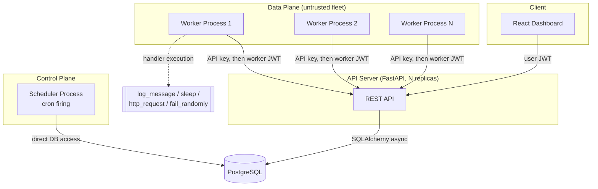
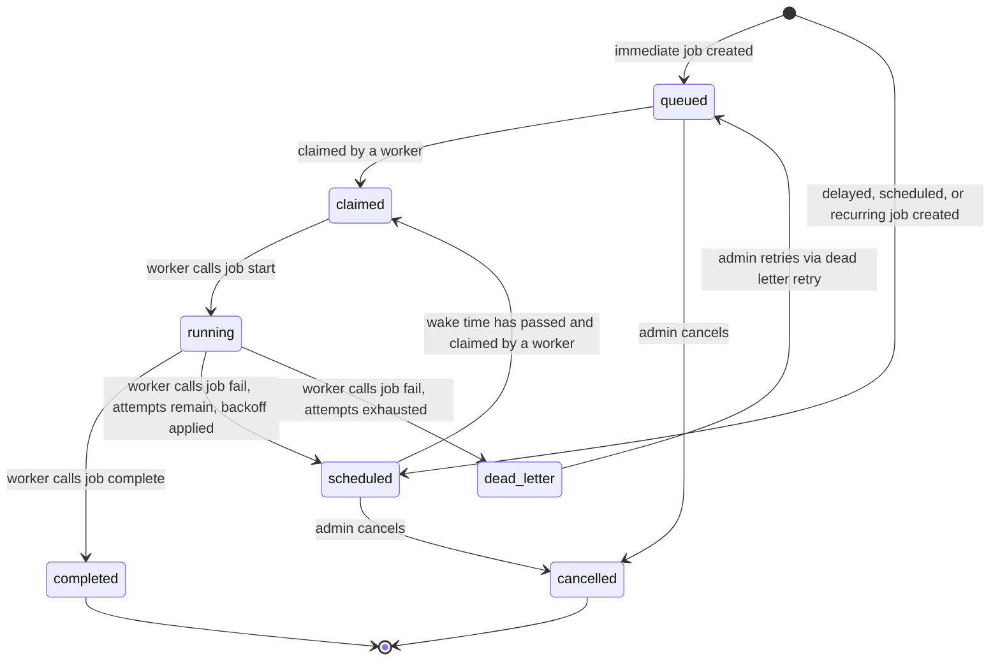
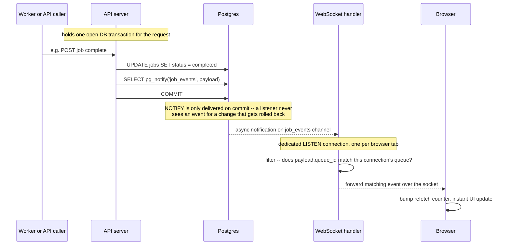

# System Architecture

## Overview



## Components

| Component | Process | Talks to DB via | Why |
|---|---|---|---|
| **API server** (`app/main.py`) | FastAPI + Uvicorn, horizontally scalable | SQLAlchemy async ORM, own connection pool | Stateless REST layer; all business logic (auth, RBAC, job lifecycle, atomic claim) lives here |
| **Worker** (`app/worker/run_worker.py`) | One process per machine/container, N of them | **REST API only**, never touches Postgres directly | Treated as an external, less-trusted fleet — see rationale below |
| **Scheduler** (`app/scheduler/run_scheduler.py`) | Single logical loop (safe to run >1 replica) | Direct DB access, same trust boundary as the API server | First-party control-plane component, not user-supplied code |
| **PostgreSQL** | Single instance (or managed HA cluster in production) | — | Source of truth; `SELECT ... FOR UPDATE SKIP LOCKED` is what makes atomic claiming work |
| **React dashboard** | Static SPA, polls the REST API + one WebSocket per open queue page | — | Polling (3-5s) is the baseline correctness guarantee; the WebSocket is a latency optimization layered on top — see below |

## Why workers talk to the API instead of the database directly

This was a deliberate architecture decision (see [`DESIGN_DECISIONS.md`](DESIGN_DECISIONS.md)).
Workers execute a `payload` against a named handler — in a real deployment, that handler code
is often owned by a different team, runs on different infrastructure, and shouldn't hold direct
database credentials. Modeling the worker↔server boundary as authenticated HTTP (project API
key → short-lived worker JWT → per-call Bearer auth) matches how most production job schedulers
(and services like it) are actually deployed, and keeps the blast radius of a compromised or
buggy worker limited to "can call these 7 endpoints," not "has a live Postgres connection."

Atomicity is not weakened by this choice: the claim endpoint (`POST /api/v1/workers/poll`) still
executes `SELECT ... FOR UPDATE SKIP LOCKED` inside a single database transaction per request.
Whether that request originates from a same-process function call or an HTTP call makes no
difference to Postgres's row-locking guarantees — see
[`claim_service.py`](../backend/app/services/claim_service.py).

## Job lifecycle state machine



## Atomic claiming, concurrency control, and reliability

1. **No double-claim.** `claim_service.claim_jobs_for_worker` runs, per eligible queue:
   ```sql
   SELECT id FROM jobs
   WHERE queue_id = ? AND (status = 'queued' OR (status = 'scheduled' AND due))
   ORDER BY priority DESC, created_at ASC
   LIMIT :available
   FOR UPDATE SKIP LOCKED
   ```
   followed by an `UPDATE ... SET status = 'claimed', claimed_by = ?` in the *same* transaction.
   Concurrent pollers skip rows already locked by another in-flight poll rather than blocking on
   them, so throughput scales with worker count instead of serializing on a single lock queue.
   Proven under real concurrent load in
   [`tests/test_claim_concurrency.py`](../backend/tests/test_claim_concurrency.py) (6 workers
   racing for 30 jobs via `asyncio.gather`, real HTTP + real Postgres — zero duplicate claims).

2. **Per-queue concurrency limits.** Before claiming, the service counts jobs already in
   `claimed`/`running` for that queue and only claims up to `max_concurrency - active_count`,
   so a queue configured for concurrency 4 never has more than 4 jobs in flight regardless of
   how many workers are polling it.

3. **Retries & backoff.** `job_lifecycle_service.fail_job` looks up the effective retry policy
   (job override → queue default → hardcoded fallback), computes the next delay via
   `fixed`/`linear`/`exponential` strategy, and either reschedules (`status = scheduled`,
   `next_retry_at` set) or moves the job to the dead letter queue if attempts are exhausted.

4. **Heartbeats & graceful shutdown.** Workers POST a heartbeat every few seconds
   (`WORKER_HEARTBEAT_INTERVAL`); `Worker.last_heartbeat_at` plus the `WorkerHeartbeat` history
   table let the dashboard show liveness. On SIGINT/SIGTERM, the worker stops polling for new
   work, notifies the server it's `draining`, waits (bounded) for in-flight jobs to finish, then
   reports `offline` — see [`run_worker.py`](../backend/app/worker/run_worker.py).

5. **Idempotency.** Jobs may carry a caller-supplied `idempotency_key`, enforced by a partial
   unique index scoped to `(queue_id, idempotency_key)`. Handler-level execution idempotency
   (e.g. "don't charge a card twice") is the handler's responsibility — the scheduler guarantees
   *at-least-once delivery with no duplicate concurrent claims*, which is the strongest guarantee
   a general-purpose scheduler can make without knowing what a job actually does.

## Bonus features

Five of the assignment's listed bonus items are implemented. RBAC is covered in
[`DESIGN_DECISIONS.md`](DESIGN_DECISIONS.md#auth-model-full-org-rbac-not-a-flat-user-owns-projects-model);
the other four:

### Distributed locking

A general-purpose primitive on top of Postgres advisory locks
([`lock_service.py`](../backend/app/services/lock_service.py)), separate from (and
complementary to) the row-level `FOR UPDATE SKIP LOCKED` used for job claiming. It's applied to
the scheduler's cron-firing pass: if you run more than one scheduler replica for HA, only one
of them actually does the firing work per tick instead of every replica racing the same query
every second. Correctness didn't depend on this (`FOR UPDATE SKIP LOCKED` inside
`fire_due_scheduled_jobs` already prevents double-firing at the row level) — this is a
throughput optimization that also demonstrates the primitive is real and reusable, not a toy.
`try_advisory_lock(db, name)` hashes the name to a lock key and yields whether it was acquired;
non-blocking (`pg_try_advisory_lock`), so a replica that doesn't get the lock just skips its
turn rather than queueing up.

### Workflow dependencies

Jobs can declare `depends_on: [job_id, ...]` at creation time. A `JobDependency` edge table
records `job_id → depends_on_job_id`; the claim query
([`claim_service.py`](../backend/app/services/claim_service.py)) excludes any job with an
incomplete dependency via a correlated `NOT EXISTS` subquery run inside the same
`FOR UPDATE SKIP LOCKED` claim statement:
```sql
WHERE ... AND NOT EXISTS (
    SELECT 1 FROM job_dependencies jd JOIN jobs dep ON dep.id = jd.depends_on_job_id
    WHERE jd.job_id = jobs.id AND dep.status != 'completed'
)
```
No new `Job.status` value was needed — a dependent job just sits as `queued` until its
dependencies clear, which composes for free with retries/rescheduling. `GET
/jobs/{id}/dependencies` reports each dependency's live status for the dashboard.

### WebSocket live updates

Built on Postgres `LISTEN`/`NOTIFY` rather than a separate broker (Redis pub/sub, etc.) — one
less moving part, and Postgres already guarantees the right delivery semantics for free:



Every job state transition (create, claim, start, complete, fail→retry, fail→dead-letter,
cancel, DLQ retry) calls `notify_job_event()`
([`notify_service.py`](../backend/app/services/notify_service.py)) **inside the same
transaction**, before the commit that makes the change durable — this is what gives exactly the
right semantics without any extra coordination.

The WebSocket endpoint (`/api/v1/ws/queues/{queue_id}`, in
[`ws.py`](../backend/app/api/routes/ws.py)) opens a **dedicated raw asyncpg connection** per
browser tab, separate from the normal SQLAlchemy pool -- `LISTEN` requires a long-lived
connection subscribed for that one client, which a pooled/recycled connection can't provide.
Auth is via `?token=<jwt>` (browsers can't set custom WebSocket headers), validated with the
same RBAC check as the REST API before the socket is accepted.

Deliberately **layered on top of polling, not a replacement for it**
([`useJobEvents.ts`](../frontend/src/hooks/useJobEvents.ts)): if the socket never connects or
drops, the dashboard's existing polling still keeps it correct, just on a 3-5s delay instead of
instant. Currently wired into the queue detail page only (stats, job table, dead letter,
recurring tabs) — the single-job detail page and project/queue list pages still rely on
polling alone.

### AI-generated failure summaries

`POST /jobs/{id}/executions/{execution_id}/ai-summary`
([`ai_summary_service.py`](../backend/app/services/ai_summary_service.py)) sends a failed
execution's error message and (truncated) stack trace to Groq's OpenAI-compatible chat
completions API and returns a 1-2 sentence plain-English diagnosis. The result is cached on
`JobExecution.ai_summary` on first request — computed lazily, not eagerly on every failure,
since most failed executions are never actually inspected by a human and calling an LLM
synchronously in the failure path would be pure waste for the common case. Entirely optional:
with no `GROQ_API_KEY` configured, the endpoint returns a clean `503`
(`ai_summary_unavailable`) rather than the app failing to start or degrading elsewhere.

## Deployment topology

`docker-compose.yml` runs: `postgres`, `api` (1 replica for local dev, horizontally scalable in
production), `worker` (replicas configurable), `scheduler` (single logical instance — safe to
run more than one since firing uses `FOR UPDATE SKIP LOCKED` too), and `frontend`.
