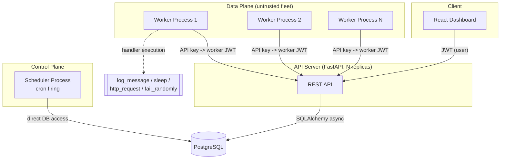
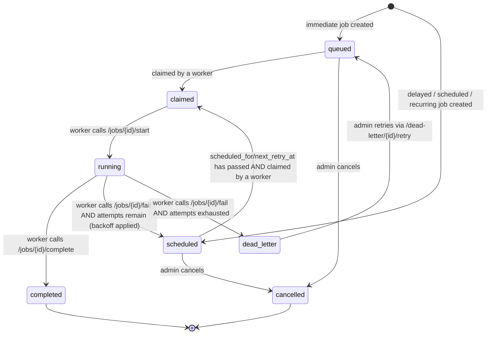

# System Architecture

## Overview



## Components

| Component | Process | Talks to DB via | Why |
|---|---|---|---|
| **API server** (`app/main.py`) | FastAPI + Uvicorn, horizontally scalable | SQLAlchemy async ORM, own connection pool | Stateless REST layer; all business logic (auth, RBAC, job lifecycle, atomic claim) lives here |
| **Worker** (`app/worker/run_worker.py`) | One process per machine/container, N of them | **REST API only**, never touches Postgres directly | Treated as an external, less-trusted fleet — see rationale below |
| **Scheduler** (`app/scheduler/run_scheduler.py`) | Single logical loop (safe to run >1 replica) | Direct DB access, same trust boundary as the API server | First-party control-plane component, not user-supplied code |
| **PostgreSQL** | Single instance (or managed HA cluster in production) | — | Source of truth; `SELECT ... FOR UPDATE SKIP LOCKED` is what makes atomic claiming work |
| **React dashboard** | Static SPA, polls the REST API | — | Read-mostly UI; polling every 3-5s is simpler than WebSockets and sufficient for a monitoring dashboard |

## Why workers talk to the API instead of the database directly

This was a deliberate architecture decision (see [`DESIGN_DECISIONS.md`](DESIGN_DECISIONS.md)).
Workers execute a `payload` against a named handler — in a real deployment, that handler code
is often owned by a different team, runs on different infrastructure, and shouldn't hold direct
database credentials. Modeling the worker↔server boundary as authenticated HTTP (project API
key → short-lived worker JWT → per-call Bearer auth) matches how most production job schedulers
(and services like it) are actually deployed, and keeps the blast radius of a compromised or
buggy worker limited to "can call these 7 endpoints," not "has a live Postgres connection."

Atomicity is not weakened by this choice: the claim endpoint (`POST /api/v1/workers/poll`) still
executes `SELECT ... FOR UPDATE SKIP LOCKED` inside a single database transaction per request.
Whether that request originates from a same-process function call or an HTTP call makes no
difference to Postgres's row-locking guarantees — see
[`claim_service.py`](../backend/app/services/claim_service.py).

## Job lifecycle state machine



## Atomic claiming, concurrency control, and reliability

1. **No double-claim.** `claim_service.claim_jobs_for_worker` runs, per eligible queue:
   ```sql
   SELECT id FROM jobs
   WHERE queue_id = ? AND (status = 'queued' OR (status = 'scheduled' AND due))
   ORDER BY priority DESC, created_at ASC
   LIMIT :available
   FOR UPDATE SKIP LOCKED
   ```
   followed by an `UPDATE ... SET status = 'claimed', claimed_by = ?` in the *same* transaction.
   Concurrent pollers skip rows already locked by another in-flight poll rather than blocking on
   them, so throughput scales with worker count instead of serializing on a single lock queue.
   Proven under real concurrent load in
   [`tests/test_claim_concurrency.py`](../backend/tests/test_claim_concurrency.py) (6 workers
   racing for 30 jobs via `asyncio.gather`, real HTTP + real Postgres — zero duplicate claims).

2. **Per-queue concurrency limits.** Before claiming, the service counts jobs already in
   `claimed`/`running` for that queue and only claims up to `max_concurrency - active_count`,
   so a queue configured for concurrency 4 never has more than 4 jobs in flight regardless of
   how many workers are polling it.

3. **Retries & backoff.** `job_lifecycle_service.fail_job` looks up the effective retry policy
   (job override → queue default → hardcoded fallback), computes the next delay via
   `fixed`/`linear`/`exponential` strategy, and either reschedules (`status = scheduled`,
   `next_retry_at` set) or moves the job to the dead letter queue if attempts are exhausted.

4. **Heartbeats & graceful shutdown.** Workers POST a heartbeat every few seconds
   (`WORKER_HEARTBEAT_INTERVAL`); `Worker.last_heartbeat_at` plus the `WorkerHeartbeat` history
   table let the dashboard show liveness. On SIGINT/SIGTERM, the worker stops polling for new
   work, notifies the server it's `draining`, waits (bounded) for in-flight jobs to finish, then
   reports `offline` — see [`run_worker.py`](../backend/app/worker/run_worker.py).

5. **Idempotency.** Jobs may carry a caller-supplied `idempotency_key`, enforced by a partial
   unique index scoped to `(queue_id, idempotency_key)`. Handler-level execution idempotency
   (e.g. "don't charge a card twice") is the handler's responsibility — the scheduler guarantees
   *at-least-once delivery with no duplicate concurrent claims*, which is the strongest guarantee
   a general-purpose scheduler can make without knowing what a job actually does.

## Deployment topology

`docker-compose.yml` runs: `postgres`, `api` (1 replica for local dev, horizontally scalable in
production), `worker` (replicas configurable), `scheduler` (single logical instance — safe to
run more than one since firing uses `FOR UPDATE SKIP LOCKED` too), and `frontend`.
