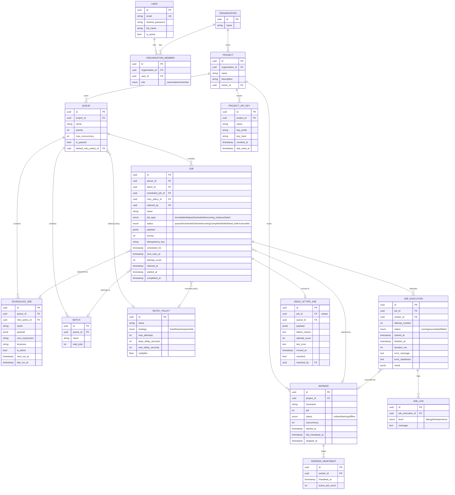

# Entity-Relationship Diagram

## Key design choices

**Primary keys.** Every table uses a UUIDv4 surrogate key rather than an auto-increment
integer. Jobs are created concurrently by many API callers and workers across (potentially)
multiple app server instances; UUIDs need no central sequence coordination and don't leak
row-count/creation-order information the way serial IDs do.

**Foreign keys & cascade behavior** (see [`DESIGN_DECISIONS.md`](DESIGN_DECISIONS.md) for the
full reasoning): deleting an `Organization` → `Project` → `Queue` cascades down, since child
rows are meaningless without the parent. Deleting a `Worker` or `User` only nulls out
references (`Job.claimed_by`, `Job.created_by`) — a job's audit trail must survive its worker
or creator being removed.

**Indexes.**
- `ix_job_claim_lookup (queue_id, status, priority)` — covers the atomic claim query so it
  stays an index scan under load, not a sequential scan.
- `uq_job_idempotency_active (queue_id, idempotency_key) WHERE idempotency_key IS NOT NULL` —
  partial unique index; only jobs that opt into an idempotency key are deduplicated, and
  completed/retried jobs don't permanently block reuse of a key.
- `ix_scheduled_jobs (is_active, next_run_at)` — the scheduler loop's hot query.

**Normalization.** `JobExecution` is a separate table from `Job`, not a JSON blob on `Job`,
so full retry history survives independent of the job's current state, and so per-attempt
metrics (duration, error) can be queried/aggregated directly. `RetryPolicy` is its own table
(not columns inlined on `Queue`/`Job`) so a policy can be defined once and reused, and so a
`Job` can override its queue's default policy without duplicating the strategy fields.
